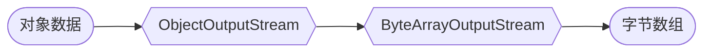

# 12-5 对象序列化

## 符号和词汇

不论是 RDBMS 还是 YAML 文件，它们所能存储的数据类型都是有限的：字符串、文本、数字等。然而，在实际的应用中，我们的代码经常需要存储**对象数据**，例如有下面这样的 Kotlin 类：

```kotlin
class PlayerData(
    val playerName: String,
    val password: String,
    val settings: Map<String, String>
)
```

我们希望有一种存储系统，可以直接保存 `PlayerData`，并且当我们读取数据时，可以直接读出 `PlayerData` 类型的对象，就像这样：

```kotlin
val pd = PlayerData("Nyaci", "********", mapOf("afk", "auto"))

store("Nyaci", pd)              // 直接保存数据

val pd1 = load("Nyaci")         // 读取数据，应该读出同样的对象
pd1 is PlayerData               // true，读出来的类型应该不变
pd1.playerName == pd.playerName // true，读出来的数据应该不变
```

遗憾的是，Bukkit 和 JDBC 都没有能够直接存取任意类型对象的能力。如果要存储一个对象，我们就需要把它转换成存储系统能理解的格式，这个过程就叫做**序列化（Serialization）**，而与之对应的就是**反序列化（Deserialization）**，从存储的数据中恢复对象信息。

在插件开发中，有好几种不同的序列化方法，我们将介绍两种比较常用的系统。

## 非结构序列化

### 标记魔法

其实，JVM 在设计之初，就内置了“把任何 Java 对象转换为字节流”的功能。Kotlin 对象也是 Java 对象，当然也能使用这一套系统。只不过，这项功能默认是不开启的，如果想要让一个类可以使用这套系统，就需要一点额外的代码。

:::tip 术语库

**字节流（Byte Stream）** 就是一列数字，每个数字占据 8 个二进制位，即 0 至 255。通常把数据用十六进制来写，例如 `aa 55 9c 80` 就是包含 4 个字节的字节流。理论上来说，计算机中所使用的一切数据，包括文本、数字、逻辑值等，内部都是用字节流表示的，例如字符串 `ciallo` 转换成字节流就是 `63 69 61 6c 6c 6f`。如果字节流所包含的数据是文本，那么这些数据通常被称作**文本数据（Text）**，否则就被称作**二进制数据（Binary）**。

:::

以下是要对 `PlayerData` 做的修改：

```kotlin
class PlayerData(
    val playerName: String,
    val password: String,
    val settings: Map<String, String>
) : java.io.Serializable {
    companion object {
        @JvmStatic
        private const val serialVersionUID = 1L
    }
}
```

我们总共做了两件事情，就让 `PlayerData` 变成了**可序列化**的：

- 实现 `java.io.Serializable`，这个接口没有任何方法，只需要把它加在 `PlayerData` 的定义之后，Java 就会认为“写这段代码的人希望这个类可以被序列化”。
- 添加以 `companion object` 开头的一块奇奇怪怪的内容，其中定义了一个 `serialVersionUID` 变量。关于什么是 `companion object`，什么又是 `@JvmStatic`，我们暂且按下不表，大家现在可以就把它当成固定写法。

`serialVersionUID` 是一个很特殊的变量，它告诉 Java 当前类的**序列化版本（Serial Version）**，Java 用它来判断所存储的数据是否来自同一个类。这么说可能有点抽象，请大家想象下面的步骤：

1. 插件存储了一个类型为 `PlayerData` 的数据。
2. 稍后插件更新了，`PlayerData` 中把 `playerName: String` 改成了 `playerId: UUID`。
3. 插件读取先前存储的数据，Java 找不到 `playerId`，一切就乱套了！

为了避免这样的事情发生，Java 要求实现 `java.io.Serializable` 的类在发生更改后，必须同时改动 `serialVersionUID`，想改成什么都行，但不能和以前用过的值重复。当读取数据时，Java 对比所存储数据的版本号，如果和当前程序指定的版本号不一致，就认为“无法读取”，于是抛出一个异常。

*大家可能会觉得“那还不如试着读一读呢！”，但其实在程序设计中，不完整的数据往往是许多 bug 的罪魁祸首，能提早发现它们，总比出了问题再去补救要好。*

### 将对象写入流

当对一个类做了这样的操作后，就可以使用如下的代码将它转换为字节流 `ByteArray`：

```kotlin
val obj = PlayerData(/* ... */)
val ba = ByteArrayOutputStream()    // 创建一个写入字节数组的流
ObjectOutputStream(ba).use {        // 创建一个读写 Java 对象的流
    it.writeObject(obj)             // 写入一个对象
}
ba.toByteArray()                    // 把字节流转换为字节数组
```

这里涉及到了一点 Java 的流操作，不过实际原理并不复杂。**流（Stream）** 是数据传输的一种方式，你可以把它想象成 Minecraft 中运输物品的水流：往一端投入物品（数据），它们就会从另一端出来。在 Java 中有两种流，分别是**输入流（InputStream）** 和**输出流（Output Stream）**，顾名思义，输入流可以读取数据，而输出流可以输出数据。

`ByteArrayOutputStream` 是一个输出流，工作原理就像水道末端的一个漏斗：它内部有一个字节数组，每当有数据写入时，它就把数据增加到数组的末尾。当稍后需要取用数据时，就可以通过 `toByteArray` 方法来查看其中的内容，和你在 Minecraft 中查看漏斗的物品栏如出一辙。

`ObjectOutputStream` 也是一个输出流，不过它的工作原理更类似于潜影盒打包机：它并不保存数据，而是把输入的内容转换成字节后传递给下一个流。我们通过 `ObjectOutputStream(ba)` 让它把数据输入刚才创建好的 `ByteArrayOutputStream`。这里我们使用了 `use` 语法，因为流和 JDBC 连接一样，包含着一些外部资源，因此需要安全地关闭。

:::note

在 Java 中，大多数的流在关闭时也都会关闭它所连接的流，所以通常只需要关闭最外层，即程序直接操作的流。

:::

当创建了 `ObjectOutputStream` 之后，我们就可以使用 `writeObject` 方法写入我们的对象。写入完成后，`ObjectOutputStream` 被 `use` 关闭，此时数据已经在 `ByteArrayOutputStream` 中，可以用 `toByteArray` 获取它。

整体的工作流程大概就是：



当然，除了把输出流接在字节数组上，也可以把它接入其它的地方，比如文件：

```kotlin
val fos = File("a.ciallo").outputStream()   // 打开一个到目标文件的输出流
ObjectOutputStream(fos).use {               // 创建对象输出流，并写入内容
    it.writeObject(/* ... */)
}
// 现在文件中已经存放了刚才写入的对象
```

### 从流中读取对象

与写入对象类似，与 `ObjectOutputStream` 对应的 `ObjectInputStream` 可以用来从流中读取对象，使用方法和一众输出流几乎完全一样，以从文件读入为例：

```kotlin
val obj = ObjectInputStream(File("a.ciallo").inputStream()).use {   // 打开一个输入流
    it.readObject() as PlayerData   // 由于是 Lambda 的最后一个表达式，这个值被赋给 obj
}
println(obj.playerName)
```

由于 `readObject` 返回 `Any` 类型（它并不知道读取的对象具体是什么类型），我们需要进行一次强制类型转换，才能得到所要的数据。与输出流类似，输入流也需要在使用后关闭。

### 强大与脆弱

Java 的这套对象序列化系统非常强大，它所要求的仅仅是让类实现一个接口，添上一个 `serialVersionUID`，随后就可以在**任何**需要的地方读写**任何**对象。不过，这样的用法虽然便利，却也有一些致命的缺陷：

- 所保存的数据不容易阅读或编辑。
- 如果被保存的类频繁更改，要保持与已有数据的兼容很困难。
- 不会调用对象的构造方法。
- 除非所有的代码都可信，否则可能会带来安全漏洞。

这些问题都很难解决，尤其是其中的第二条，对于插件来说更是灾难性的，因为倘若要保存的类使用了来自依赖库的类型（这很常见），而依赖库当中的类发生了变化，那么 Java 就可能读取不了先前保存的数据。在一些服务器上，当插件请求一个依赖库的时候，服务器可能不会每次都提供完全一致的版本，这就会导致“昨天保存的数据，因为今天多了一个完全无关的新插件，突然读取不了了”这样根本无从发现和预防的情况。

所谓“越是强大越是脆弱”，用于形容 Java 的这套序列化系统是再合适不过了。鉴于以上这么多缺点，虽然它用起来很方便，但我们还是不得不挥泪向它告别，并将目光转向更安全的……

## 结构序列化

### Kotlin 的序列化

Java 的序列化系统是**非结构（Non-Structured）** 的，因为想让一个类可以序列化，只需要让它实现 `Serializable` 接口，而不用管它的属性具体如何被转换成字节流 —— JVM 使用一些深奥的“魔法”把它们转换成可以保存的数据。然而，这样的做法虽然方便，但在数据兼容性和安全性方面实在是太糟糕了。

与非结构序列化对应的就是**结构（Structured）** 序列化，结构序列化的思想很简单：

- 数字、字符串和逻辑值等基本类型可以直接序列化。
- 对于所有其它的类型，先把它的每个属性都序列化，然后把这些序列化的结果拼起来。

像这样的序列化是按结构进行的（每个属性序列化完成后，再组装成最终的结果），这种方式因此得名。需要注意的是，结构序列化并不是一种特定的技术，它有很多实现方式，Bukkit 中的 YAML 配置就是一种。

Kotlin 在编译器层面提供了一套高效的结构序列化系统，可以把 Kotlin 对象的数据转换为 JSON、CBOR、ProtoBuf 等多种可读格式（甚至也包括 Minecraft 所使用的 NBT 格式！），这就是 **Kotlin 序列化系统**。这套系统尽管很强大，使用起来却出人意料地简单，而且所生成的格式由于是通用的数据交换格式，即使不是 Kotlin 编写的插件，也可以读取它们。

:::tip 术语库

**数据交换格式（Data Exchange Format）**，指的是能在不同语言编写的程序之间交换数据的格式。除了已经见到过的 YAML 外，上面提到的 JSON、CBOR、ProtoBuf 也都是数据交换格式。这些数据可以由一种语言的程序产生，并由另一种语言的程序读取，以此来在两个本来语言不通的程序之间交换共通的数据。

:::

由于 Kotlin 序列化系统是基于编译器插件的（也就是说，它要在 Kotlin 编译器上做些手脚），而 Kotlin 编译器由 Gradle 负责配置，因此需要先向 `build.gradle.kts` 中添加一些代码：

```kotlin
plugins {
    // 可在 https://kotlinlang.org/docs/serialization.html 查到最新的版本
    kotlin("plugin.serialization") version "2.2.0"  
}
```

:::info

一般来说 `build.gradle.kts` 中已经有 `plugins` 块了，由于 Gradle 不允许 `plugins` 出现在文件开头之外的地方，因此请把序列化插件添加在已有的 `plugins` 块内，而不要另起一块。

:::

然后，根据打算序列化的目标数据格式（也就是序列化的产物），还需要添加对应的序列化依赖库：

```kotlin
dependencies {
    // JSON
    implementation("org.jetbrains.kotlinx:kotlinx-serialization-json:1.9.0")

    // CBOR
    implementation("org.jetbrains.kotlinx:kotlinx-serialization-cbor:1.9.0")

    // NBT
    implementation("net.benwoodworth.knbt:knbt:0.11.8")
}
```

*以上的三种格式只是示例，只需要选择你打算使用的格式即可。顺便一提，你可以在 [Kotlin 序列化格式列表](https://github.com/Kotlin/kotlinx.serialization/blob/master/formats/README.md) 查找到所有支持的格式。*

:::info 你是哪格式的？

具体要选择哪种目标格式，需要根据插件希望的存储方式来决定。如果需要文本格式或者适合 Web 请求的格式，[JSON](https://www.json.org) 就更加合适；如果想要数据的体积尽量小，[CBOR](https://cbor.io) 和 [BSON](https://bsonspec.org) 提供了基于二进制的编码格式；而若是要与已有的数据系统交互（例如 NBT 存档），那当然是要选择它们所使用的格式（笑）！

:::

做了这样的修改后，请按以往的方式同步 Gradle 项目。

### 标记（但不是魔法）

我们仍然以 `PlayerData` 为例。为了让 `PlayerData` 能够被 Kotlin 序列化系统识别，我们需要对它进行一点修改：

```kotlin
// 也可以导入注解：
// import kotlinx.serialization.Serializable
// @Serializable
@kotlinx.serialization.Serializable
class PlayerData(
    val playerName: String,
    val password: String,
    val settings: Map<String, String>
) {}
```

只需要对 `PlayerData` 增加一个 `kotlinx.serialization.Serializable` 注解，就可以让它变成可序列化的，就像 `@EventHandler` 能把一个方法变成事件处理函数那样。在做了这样的修改后，就可以使用相应的序列化库，将这个类的对象转换为字符串：

```kotlin
// 以 JSON 为例
val obj = PlayerData(/* ... */)
Json.encodeToString(obj)    // { "playerName": "Nyaci", ... }
```

`encodeToString` 方法把指定的对象转换为对应的 JSON 表示，这样就 OK 了，不需要什么 `ByteArrayOutputStream` 或者 `ObjectOutputStream`，只需要简单调用一个方法，就可以搞定一切（笑）。当然，从字符串转换回来也很容易，只需要使用另一个方法：

```kotlin
val str = "..."
val obj: PlayerData = Json.decodeFromString(str)
```

`decodeFromString` 从给定的字符串中提取出原本的类信息。值得注意的是，与 Java 不同，Kotlin 序列化系统不需要使用强制类型转换，取而代之的是对 `obj` 的**显式类型声明**，即 `PlayerData`。`decodeFromString` 会尝试把输入的字符串转换为指定的类型。

<details>
<summary>你是职业选手吗？</summary>

与 Java 序列化系统不同，Kotlin 使用编译器插件，对加有 `@Serializable` 注解的类生成对应的序列化和反序列化代码。这么做可以避免使用反射等动态方法构造数据所带来的性能开销，因为每个类都“知道”如何把自身转换为字符串。

</details>

值得一提的是，与 `java.io.Serializable` 接口不同，`@Serializable` 只能加在所有属性都**已经可序列化**的类上。在上面的例子中，`String` 和 `Map<String, String>` 都是可序列化的 —— 作为 Java 中常用的数据类型，Kotlin 已经写好了对应的转换代码。不过，要是碰到像下面这样的类：

```kotlin
class ExtraPlayerData(
    itemInHand: ItemStack,
    properties: Location
)
```

直接添加 `@Serializable` 就行不通了。还记得我们提到过的吗？Kotlin 序列化系统是**结构化**的，序列化一个类的方法就是序列化它的每个属性，再把它们拼起来。因此，如果某个属性不是可序列化的，我们就需要让它变得可序列化，方法同样是加上 `@Serializable` 注解……

> Nyaci：如果第二个类也有不可序列化的属性呢？难不成还要重复这样的操作……？

啊，Nyaci 她总是把坏事猜得特别准（笑）。不过这确实是事实，如果发现一个属性不可序列化，就要为它添加 `@Serializable`，在这个过程中如果又碰到了不可序列化的属性，就得继续下去，一层一层，直到所有的属性都已经是可序列化的为止。这是有些麻烦，不过还有更麻烦的：如果我们修改不了目标类呢（比如上面的 `Location`）？那就难办了！

*对于这种问题，开发者们通常要编写额外的代码来序列化指定的类，如果你很好奇，可以看看 [Kotlin 序列化器](https://github.com/Kotlin/kotlinx.serialization/blob/master/docs/serializers.md) 当中的介绍。*

---

关于序列化和反序列化的内容是如此之多，以至于我们仅仅是在这一节里窥探了冰山一角，就花去了不少篇幅。序列化和反序列化是数据存储中的一个相当重要的过程，它把对象在内存中的不稳定形态（包含着许多运行时信息）转换为可以在多次运行之间共享的稳定形态。各式各样的 Java（和 Kotlin）程序都使用着不尽相同的序列化方案，除了介绍到的两种序列化系统之外，还有许许多多其它的库，都可以做到类似的事情。也许，“把数据转换为字符串”这个问题的答案，永远也不会被穷尽。