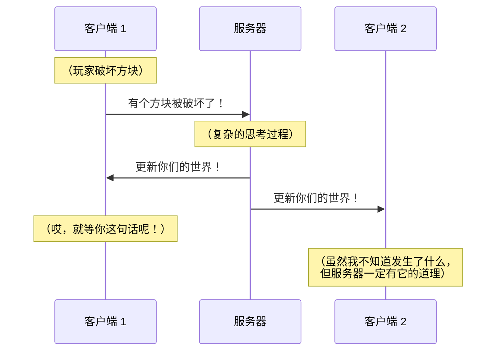

# 0-1 那什么是插件呢

你也许已经知道插件是安装在服务器上的，也许听闻过服务器的管理员（外号“技术”）抱怨“插件又炸了”，说不定还自己用过几个，然后被各种 `.yml` 文件弄得晕头转向……但你或许还不完全明白，到底**什么是插件**，它**能做什么**，又**做不了什么**。

要弄清楚这个问题，不先搞明白服务器的原理是行不通的！

## 多人游戏是如何运作的

多人游戏的核心是**一群玩家**，每个玩家在自己的电脑上运行一个（或多个）Minecraft **客户端**。但是，只有这些客户端可不够！在多人游戏里，你挖掉一个方块，其他玩家也同时会看到这个方块被挖掉。这就说明，有些东西在负责**将一个客户端发生的事情，告诉其它客户端**。

这就是**服务器**。服务器负责**同步**各个客户端上的数据。确切地说，在 Minecraft 多人游戏中，世界数据是这样存储的：

- 服务器存储着**权威**的世界数据，它是多人游戏中唯一的话事人。
- 各个客户端存储着服务器世界的一个**副本**，以供玩家游玩。
- 如果客户端的世界发生变化（例如，玩家挖掉方块），客户端可以**推送**这个变化到服务器，请求服务器更改数据。
- 如果服务器的世界发生变化（例如，其它玩家挖掉了某个方块），客户端需要将自身的数据**修改**为与服务器一致。

这么说可能比较抽象，下面我们来看一个具体的例子。

> Nyaci 今天在矿井底部发现了一些稀有的钻石矿，激动的心，颤抖的手，她从背包中抽出早些时候新打造的“精准采集”铁镐，谨慎地观察确定周围没有岩浆（或者其它可怕的东西）之后，小心翼翼地将这块来之不易的矿石整个取下，打算带回基地以备日后不时之需。

*文笔也许有些粗糙，大家理解意思就好（笑）。*

抛开那些为了渲染气氛做的描写，“挖掘钻石矿石”这件事情，在游戏内其实经历了以下三步。为了叙述的方便，我们假设方块能被瞬间破坏。

1. 第一步发生在**客户端**，玩家点击鼠标左键，游戏判定对应的方块已经被破坏。
   
   客户端随后**向服务器发送这样一条消息**：
   
   > 喂喂，听得见吗，位于 (123, 45, 678) 的方块已经被玩家 Nyaci 使用主手的工具破坏！
   
    好吧，这看上去不是很有礼貌，甚至有些粗鲁，你可能觉得服务器会被这种语气惹毛，但在计算机的世界里，通讯效率才是最重要的，实际发送的数据要比这样的语言表达还要简短得多。总之，这条消息**通过网络发送到了服务器**，就像电子邮件发到了收件箱那样。

2. 第二步发生在**服务器**，这是事情真正开始变得有趣的地方。客户端只要报告发生的事情就好了，而服务器要考虑的就很多了。

    服务器读到这条消息，它要进行**处理**，也就是根据客户端的消息变更自身存储的世界数据。它的思考过程大概如下：
   
   > 哦，在 (123, 45, 678) 这里的方块被什么东西破坏掉了。
   > 
   > 那么，首先我需要移除这个方块，也就是说，把 (123, 45, 678) 处的方块变更为空气。
   > 
   > 随后，我应该考虑方块的掉落物。
   > 
   > 根据我的资料，在 (123, 45, 678) 这里的方块是一个钻石矿石。
   > 
   > 我还需要看看玩家的主手拿着什么，Nyaci 的主手持有一把铁镐，具有精准采集附魔。
   > 
   > 那么，我需要计算这把具有精准采集附魔的铁镐，挖掘钻石矿石，会掉落什么。
   > 
   > 根据我的资料，钻石矿石对精准采集附魔的铁镐掉落物是一个钻石矿石（物品）。
   > 
   > 那么，我确定这个方块的掉落物是一个钻石矿石（物品）。
   > 
   > 我应该把它放在方块原先所在的地方，也就是 (123, 45, 678)。
   
   在做了这些变更后，服务器**向所有客户端发送这样的消息**：
   
   > 那个，米娜桑，可以的话，请把 (123, 45, 678) 处的方块删除，然后，在那里放置一个钻石矿石（物品），好不好？
   
   这条消息通过网络从服务器送达各个客户端。

3. 最后一步，回到**客户端**，客户端收到以上的消息，并**相应改变**自身的副本。Nyaci 于是就能看见，钻石矿石被挖掉，而地面上多了一个相应的物品。

这就是多人游戏的大致过程。如果还需要更多解释的话，“一图胜千言”，以下是图解：



:::note 为什么不自己来？

你可能会想，客户端应该也知道“钻石矿石挖了会掉什么”，为什么一定要**等到服务器答复后**才更新自己的世界呢？就不能自己来吗？

这种想法固然有道理，可若是在网络比较差的情况下，数据包可能会丢失，服务器压根不知道客户端这边发生了什么。在这种情况下如果大家都“自顾自地”更新各自的世界，那就乱了套啦！

:::

## 插件能做什么

Minecraft 社区这么多年来所付出的努力，绝大多数都是关于**如何修改游戏**的，插件也不例外。在上面的这个流程中，哪些部分是插件能干预的呢？

由于插件只安装在服务器上，**只能影响服务器的行为**，因此我们只能修改上述三步中的第二步：服务器的思考过程，也就是**服务器处理**。虽说是“只能”，但实际上能做的事情可太多了，比如：

- 把掉落的钻石矿石数目变为两倍
- 在掉落物的位置放置一个激活的 TNT
- 忽略客户端的请求，让这个矿石挖不掉

由于服务器上的世界一旦发生变化，客户端就必须无条件地听从，因此服务器理论上是可以随心所欲地修改**服务器上的世界数据**的，即使是像把世界里所有的水都变成岩浆这种“天方夜谭”的想法也完全可以做到。虽说是世界数据，但其实以下的所有内容都是可以**通过在服务器的修改反映到客户端的**，它们也都属于插件开发的范畴：

- 地图数据（方块、物品、实体等）
- AI 逻辑（生物寻路、村民作息等）
- 玩家间消息（聊天、玩家名称等）
- 游戏机制（天气、红石等）

……以及很多其它方面的东西。

当然，与以上相对的，也有插件所无法做到的事情，因为有些工作**只发生在客户端**，服务器无从干预：

- 与客户端显示相关的内容（资源包、亮度等）

    *这也是至今都没有很有效的手段反制永久夜视的原因之一，客户端可以把方块显示得任意亮，而服务器根本不知道这件事。*

- 客户端拒绝报告的事件（玩家移动、方块挖掘等）

    *这也是至今都没有很有效的手段反制灵魂出窍的原因之一，客户端可以随意移动观察的位置，而服务器根本不知道这件事。*

- 玩家的输入方式（鼠标、键盘等）

    *这也是至今都没有很有效的手段反制自动瞄准的原因之一，客户端可以随意拉动视角的朝向，而服务器根本不知道这件事。*

……以及，同样，很多其它方面的东西。

:::info 合适的才是最好的

上述的这些事实可能会些微打消你开发插件的念头，毕竟这些事情模组可都能做到！但是，读者需要明白的是，尽管模组能提供更多的可能性，但要做到插件所做不到的事，并非毫无代价。

相比插件，大多数模组必须在客户端和服务器同时安装，且版本稍有不对就会满屏报错，而插件只需要在服务器安装，玩家可以使用任何兼容的客户端加入游戏，并且开发起来也比模组简单很多，这种灵活性是模组无法提供的。

应该说，从数据包到插件再到模组，没有哪一种技术是完全优于另一种的，选用哪种技术必须根据实际需求进行权衡。

:::

## 如何修改一个服务端

要改变服务器的行为，我们就需要修改**服务端软件**。有些读者可能是第一次听到这个词，服务端软件其实就是先前提到的，在服务器上运行的 Minecraft。

大家都知道，软件是由**源代码**编译（确切地说，应该称作**构建**）而来的，作为商业游戏，Mojang 自然不会提供游戏的源代码，但那样也无妨，因为 Minecraft 所使用的编程语言 Java 有一个很重要的特性：可以很方便地进行**反编译**，从游戏文件重新提取游戏的源代码。

基于此，如果想改变服务端的行为，最直接的办法就是：

1. **反编译**服务端，提取源代码。
2. 根据需要**修改**源代码。
3. 把修改完的源代码**重新编译**成新的服务端。

在 Minecraft 早期，模组开发者采取的也确实就是这种方法。

:::note 在过去

在很早的时候（大约是 Minecraft 1.2 到 1.6 那段时间），模组的作者会提供一组 Jar 文件，玩家需要自行把这些文件与 Minecraft 客户端合并来游玩模组。那时候没有什么 Fabric 也没有什么 Bukkit，有的只是各种解压和压缩程序，还有因为模组冲突而满天乱飞的崩溃报告！

:::

这种方法非常直接，但问题也很明显：如果两个插件（应该叫做“补丁”）都打算修改游戏的同一个部分，那该怎么办呢？安装插件的人必须**小心地修改代码**，否则轻则某些游戏机制瘫痪，重则服务器整个崩溃。而要正确地修改这些代码又是极其困难的，为了让读者了解这是何等的困难，请读者阅读以下关于活塞移动的代码（只截取了很小一部分）：

```java

public class dwq extends diz {
    public static final MapCodec<dwq> a = b(dwq::new);
  
    // ...
  
    public static final dxv<jn> b = dws.a;
  
    public static final dxv<dxz> c = dws.c;
  
    @Nullable
    public dua a(ji $$0, dwy $$1) {
        return null;
    }
  
    public static dua a(ji $$0, dwy $$1, dwy $$2, jn $$3, boolean $$4, boolean $$5) {
        return new dwu($$0, $$1, $$2, $$3, $$4, $$5);
    }
}

```

*好啦好啦，不要就这么被吓跑了，这实际上是混淆后的代码，Mojang 为了不让人轻易地了解源代码的内容（也为了缩减一些游戏文件体积），就把代码里的名称都换成了这种奇奇怪怪的样子……实际的代码可没这么吓人，不哭不哭，摸摸（*

言归正传，即使是使用可读的名称，请专业的工程师来审阅代码，要正确修改服务端程序也是非常困难的。随着插件数目的增加以及插件代码的复杂化，直接修改服务端这件事变得不再可行。社区的开发者们迫切需要达成一个公约，决定如何正确地修改服务端而不至于产生冲突。

**这个所谓的公约就是 Bukkit。**

## 如何（优雅地）修改一个服务端

Bukkit 通过非常仔细地修改 Minecraft 服务端程序，为各位插件开发者**提供了一套便捷使用而又不会产生冲突的接口**。插件开发者们只需要“面向 Bukkit 编程”就可以了，剩下的工作就悉数交给 Bukkit 完成。Bukkit 通过合理地安排和组织插件所提交的任务，确保不会在服务器运行的时候产生冲突（或者其它意外的错误，比如电源爆炸什么的）。

在有了 Bukkit 之后，插件的开发过程就变为：

1. 根据 Bukkit 提供的接口，**编写**插件代码，并编译为一个（一组）Jar 文件。
2. 把插件**复制**到服务端的 `plugins` 文件夹中。
3. 由 Bukkit 负责将插件中的代码逻辑**添加**到服务端中。

这看上去很魔幻，但随着本书内容的深入，读者将逐渐了解 Bukkit 是如何做到“统一各插件的行为”的。插件与 Bukkit 的关系这么紧密，总给人一种感觉，那就是本书与其说是《插件设计与编程》，不如说是《面向 Bukkit 的插件编程》呢（笑）。

由于一些原因，Bukkit 项目后来由 Spigot 接续。此后又有人基于 Spigot 开发了 Paper。在功能对比、性能较量和用户选择之下，原版的 Spigot 由于竞争力不足而逐渐淘汰出社区。如今，**Paper 及其衍生产品已经成为插件服务器中的主流选择**，因此本书虽说是做 Bukkit 插件，实际上却是做 Paper 插件，大家如果因为感觉被蒙了一把而气愤不已的话，笔者也只能在这里向大家做个迟到的道歉了（笑）。

:::tip 未曾听闻？

或许你可能在某些地方见过 CatServer、Arclight、Cardboard 这些名字，它们大多是为了能在同一个服务端中同时运行模组和插件所做的努力。这些服务端多数都与 Bukkit 插件兼容，很大程度上也与 Paper 插件兼容。因此，在本书中学到的知识也能支持你为这些服务端编写通用或专门的插件。

:::

这一节太长了，原本笔者计划在这里介绍关于 Kotlin —— 我们选用的开发语言 —— 的一些趣事的，那么我们就在下一节里再与它见面吧！