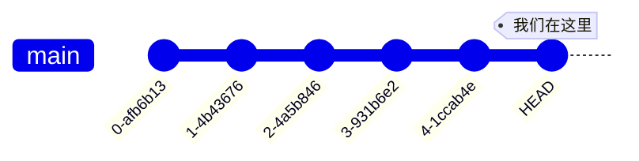
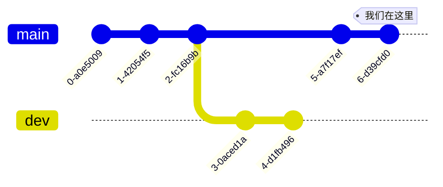
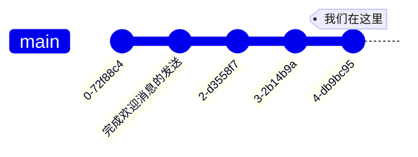
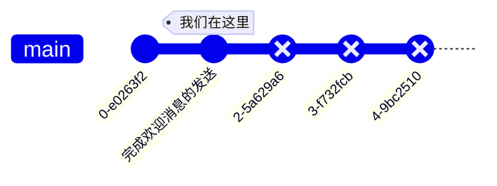
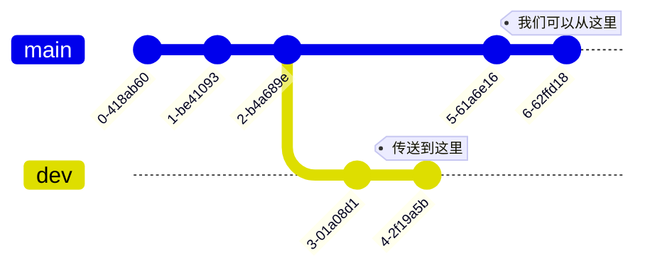
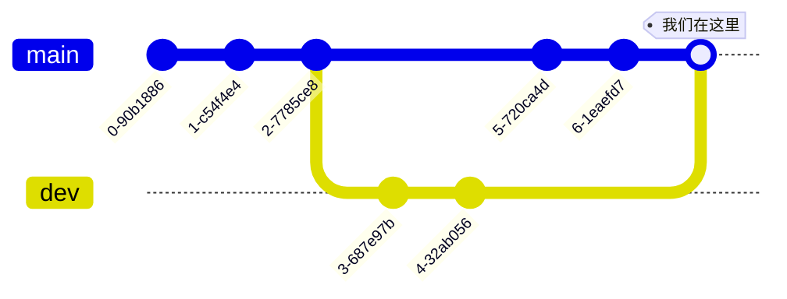

# 11-2 Git 基本操作

在能真正在项目中操作 Git 之前，我们需要先了解 Git 中的一些基本概念和操作。

*如果你玩过 Palette 出品的 9-nine 系列游戏的话，这一节的内容将非常容易理解 —— Git 简直就是那里所描绘的时间线的翻版！不过，即使没玩过也不要沮丧，因为 Git 不仅强大，使用起来还非常简单。*

## 提交：时间节点

Git 的作用和时间机器差不多，不过它并不能真的倒转时间（那是魔法！），相反，它的用法更类似于相机：你可以用 Git 对项目的代码进行“拍照”，术语称作**提交（Commit）**，记录下文件中当前的内容。一旦进行了一次提交，Git 就会将它保存下来，稍后你可以通过 Git 把项目中的文件恢复到提交时的状态。

在实际的情况中，Git 会对每个提交生成一个唯一的编号，以十六进制表示，所以真实的提交看上去像这样：

## 抛弃：不保存修改

Git 的提交不是实时进行的，而是我们在修改了代码后，觉得是时候该“拍照”时才**根据需要**创建的。换句话说，在 Git 中，修改文件和提交的工作流程大致如下：

1. 修改文件，添加、改动或删除代码。
2. 积累了一定量的修改后，就创建一个提交。

Git 允许我们随时**抛弃（Rollback）** 未提交的修改，也就是说，在一次提交之后，如果我们改动了一些文件，并且尚未提交，然后又决定不要它们了，那么我们可以立即回到最近一次提交的状态。

*想知道我在极限模式中十次摔落虚空还能生还的方法吗？哈，不是末影珍珠，而是发动“霸主权能（OVERLOAD）” —— 终止进程然后回档！*

在 Git 中，绝大多数的操作都要求我们**精确地位于某个提交之处**，也就是说，除了提交和抛弃修改本身，在进行大多数操作前，必须先**提交修改**，或者**抛弃它们**。这和公交车的运行比较类似 —— 如果想搭车，就必须去车站，而不能半路上下车！

## 分支：平行世界

Git 的另一个非常强大的功能是**分支（Branch）**，它允许我们从任何一个节点开始，创建多条“时间线”，有点像 Minecraft 中的多个维度。我们可以同时在多条时间线上进行完全不同的修改，而互不干扰彼此：

这里有两条分支，分别是 `dev` 和 `main`，它们的前三次提交相同，之后开始分离，走上不同的道路。我们可以在这两条分支上分别对项目的文件进行修改，随心所欲地创建提交，而**不影响另一条分支上的内容**。

## 回退：倒退时间线

Git 允许我们**回退（Reset）** 当前的分支：我们可以“传送”到过去的任何一个提交，也就是**回到过去**！Git 会把项目中所有的文件都恢复到指定的提交中保存的状态。

例如，在上面的这条分支里，如果我们突然发现“发送欢迎消息”这个功能坏掉了，而且也不知道怎么修复，那么我们就可以通过 Git 回退当前分支，回到这个功能还能正常工作的时候，然后再重新来过：

从逻辑上来说，时间线一旦回退，那么“过去的未来”，也就是被倒退掉的那些提交，实际上**还没有发生**，因此它们就不再属于这条时间线了，会被 Git 自动删除，所以分支 `main` 就变成这样：

我们稍后可以在这个基础上继续创建新的提交。

*为了防止误操作，Git 还是允许我们在（现实中的）一段时间内重新“前往未来”的，但理论上 Git 有权随时删除被回退的修改。*

## 签出：穿梭时间线

当我们创建了多个分支后，我们就可以在**每个分支的最新状态**之间自由地“旅行”，术语称作**签出（Checkout）**。我们可以像索菲缇娅那样随时前往任何一个时空！只不过在 Git 中，做到这一点更加容易，不需要经过世界间的夹缝或者什么类似的地方。

Git 会在我们选定了目标分支后更新项目中文件的内容，因为我们本质上是从一个提交切换到了另一个提交（尽管它们位于不同的时间线）。不仅是回退和变更分支，在任何其它时候我们改变了提交（即“穿梭时空”）时，Git 也都会**自动更新文件**。

*实际上 Git 可以随意前往任何一条分支的任何一个提交，不过如果不是前往最新的提交，整个系统的状态会变得复杂一些。为了不至于让读者迷失在世界间夹缝的某个角落，本书中就略过这部分内容，这不影响 Git 通常情况下的使用。*

## 合并：统一未来

这可能是 Git 中最有魅力的功能之一，我们可以把两条时间线**合并（Merge）** 在一起，让它们回到相同的道路上！“那不存在的未来，如今正在你的眼前展现。”大概就是这个意思。

在这里，我们把 `dev` 分支**合并入** `main` 中，两条分支合并为一条，`dev` 的未来至此宣告终结，只留下 `main` 继承它的提交继续前进。 

Git 会把在两条分支上分别做的修改**合并在一起**，例如，假设我们在两条分支上分别做了如下的改动：

- `main`：在 `Main.kt` 中新增 `sayHelloLoudly` 函数。
- `dev`：在 `Main.kt` 中新增 `sayByeLoudly` 函数。

那么合并之后，`Main.kt` 中就会同时有这两个新添加的函数。

在大多数情况下，Git 都足够聪明，它能够正确地把所有的改动合并到一起。不过，如果两条分支修改了某个文件的相同部分，那么 Git 会认为“让我来合并不太保险”，因此无法自动合并，这时就需要我们来手动进行合并。

*实际上，一条分支被合并后，它的未来并没有结束，我们仍然可以在这条分支上继续创建提交。不过，为了尽量减少分支的数目，工程师们通常会在合并分支后删除它，在下次需要时再创建一个新的。*

## 变基：分枝剪定

*此处的“分枝”是专有名词，而非拼写错误。*

能够合并时间线已经很强大了，但 Git 能做的不仅如此 —— 它还能直接**修改时间线本身**！“剪定”是游戏中的术语，在 Git 中，这项工作叫做**变基（Rebase）**。

变基非常强大而且灵活，它可以完成以下的工作：

- **丢弃（Drop）**：从分支上删除一些提交，这些提交所对应的“影响”，即相应的修改，也会在后续的提交中被删除，就好像它们从来没有发生过一样。
- **连接（Squash）**：把多个提交合并为一个。
- **移动（Move）**：将一些提交挪到当前分支或其它分支的指定位置，这些提交对应的修改会从它们原本后续的提交中删除，并在目的地后续的提交中增加，就好像它们本来就在那里发生一样。

尽管变基是如此强大，但想必大家看了这些功能的描述之后也会猜到，在多条分支之间移动修改，并且还要消除相应的影响，是一件很困难的事情。事实上，进行大幅度变基时，Git 几乎总是会和合并一样产生冲突，并且要解决这些冲突非常麻烦，有时还会引发非常复杂的连锁反应。

有鉴于此，本书中仅提及变基和它的大致功能，而不向各位读者介绍其用法。大家只要知道“哦，有这么强大的东西”就可以了。本书中的项目不会用到变基，大家在真正需要使用变基时，再去阅读相关的文章也不迟。