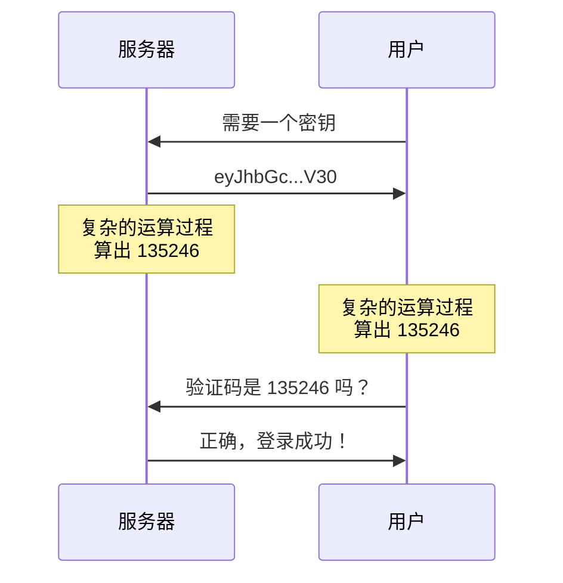

# 8-1 安全保险

## 一次崩溃引发的惨案

以下是一个关于服务器安全的故事：

> Nyaci 在我们的服务器上担任管理员。当天，服务器的游戏版本刚刚升级，Nyaci 因此需要升级她的客户端版本。由于她没有更新显卡驱动，因此新版本的客户端无法正常启动。Nyaci 不知道那些报错是什么含义，她所使用的启动器生成了一系列崩溃报告文件，于是她将这些文件上传到论坛，希望有人能解决她的问题，而灾难的种子就此埋下。
>
> 天真的小丫头不知道，启动器生成的文件中包含着游戏参数，而后者又包含着她 Minecraft 帐户的令牌。一位别有用心之人发现了这份文件，并从中提取了帐户令牌，这个令牌可以用来启动游戏。我们不知道此人的身份，更无从得知它为什么对我们的服务器满怀怨念，但总之，坏人拿到了管理权限，而且事情也彻底失去了控制。
>
> 我们的服务器上装有多个仅供管理员使用的插件，这些插件的权力非常大，可以改动其它插件的配置、服务器配置甚至删除存档。坏人在凌晨登入了服务器，摧毁了几乎所有的数据，等到第二天早上我们发现问题时，一切已经太晚了。
>
> 这件事情最后是怎么解决的呢？不幸中的万幸是，我们的云服务商提供每周一次的全盘备份，我们从那里恢复了服务器四天前的数据，并且向所有玩家发放了相关补偿。然而，此事对服务器信用造成的影响，直至数个月后才勉强得以平息。而令我们全体管理人员难以接受的是，我们至今不知道坏人是谁，也无从制裁它的行为。

很可怕吗？是的，很可怕。如果这只是一个故事就好了，但遗憾的是，尽管人物是虚构的，但**这是一件真实发生过的事情**。启动器的漏洞、用户的疏忽、插件过高的权限，共同造成了不可挽回的损失。

自这次事故之后，我们开始要求所有管理员使用**双重验证**，这样即使帐户被盗，我们仍能在坏人进入服务器前加以阻止。

## 第二道防线

**双重验证（Two Factor Authentication，2FA）** 就是在密码之外额外增加一个验证步骤，最常见的双重验证是短信验证码，但在没有办法使用短信的场合，也可以使用**基于时间的一次性验证码（TOTP）** 进行验证。

TOTP 中牵涉两个角色，分别是**服务器**和**用户**，服务器希望验证用户的身份，流程如下：

1. 在注册时，用户向服务器申请一个**密钥（Secret）**，密钥就是一种非常长（可以有几百位）的密码。
2. 服务器和用户分别存储这个密钥。
3. 在登录时，服务器根据密钥和当前时间，计算出一个 6 位数字，即**一次性验证码（OTP）**。
4. 用户的程序完成相同的运算。
5. 用户将 6 位数字发送给服务器，如果二者一致，用户就成功登录。

验证码的生成过程**不可逆**，任何人都无法通过验证码来推出用户的密钥。只有服务器和真正的用户知道这个密钥，所以只有一开始持有该密钥的用户能输入正确的验证码。只要密钥不泄漏，就没人能猜出来，而密钥通常加密存储在用户的设备上，除非有意为之，否则很难被盗。

由于 TOTP 原理简单，而且双方都不需要联网就能计算验证码，而且安全性很高，因此被广泛应用在各种双重验证系统中。

TOTP 的密钥通常是以**二维码（QR Code）** 的形式发给用户的，用户需要在设备上安装一个 TOTP 程序，扫描该二维码录入密钥，并生成验证码。我们稍后将介绍一些这类软件。

## TOTP 插件

下面就让我们回到破坏事件发生的当天。

现在是早上七点整，服务器上的一地狼藉令人心碎。Nyaci 很自责，Misty 在安抚玩家们的情绪，而服主 Aluka 则一言不发。作为开发者，我决定要做些什么：

> **双重验证（TOTP）**
>
> 在服务器上实现 TOTP 的颁发和验证，要求所有玩家启用 TOTP。
>
> - 未启用 TOTP 的玩家登录时，插件将生成一个二维码，要求玩家录入。
> - 玩家登录后，须在聊天栏输入验证码，方可游玩游戏。
> - 未授权玩家仅能使用旁观模式，而且无法移动、发送聊天或使用命令。
>
> “……你是因为，有所失，才决定，不要再失去。”

那时，我匆忙地写下 Java 代码（那时 Kotlin 还不流行），来不及做太多的测试，就将插件安装在了服务器上。而现在我们又回到了一切开始的时候，但这次，我们有充足的时间来准备……